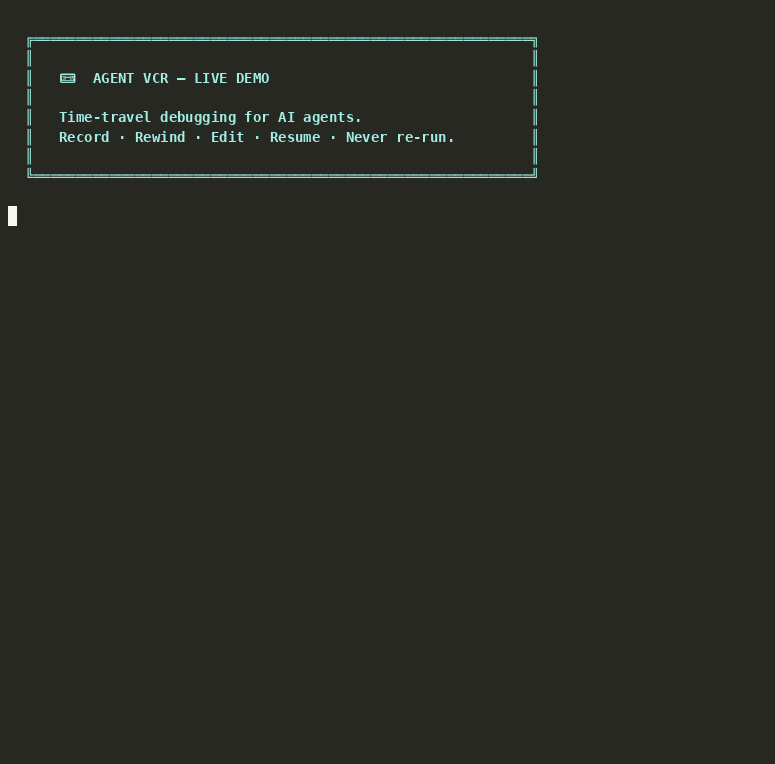

<div align="center">

# 📼 Agent VCR

### Time-travel debugging for AI agents.
**Record · Rewind · Edit · Resume — without re-running anything.**
<br>
<a href="https://pypi.org/project/ai-agent-vcr/"></a>
<a href="https://github.com/ixchio/agent-vcr/actions"></a>
<a href="https://codecov.io/gh/ixchio/agent-vcr"></a>
<a href="https://opensource.org/licenses/MIT"></a>
<a href="https://www.python.org/downloads/"></a>
<br><br>
[📖 Docs](https://ixchio.github.io/agent-vcr/) · [🚀 Examples](examples/) · [🛡️ Sentinel](https://ixchio.github.io/agent-vcr/sentinel/) · [📊 Benchmarks](https://ixchio.github.io/agent-vcr/dev/bench/)

<br>

</div>

<!-- DEMO -->
<p align="center">
  
</p>

<br>

<div align="center">
  <code>pip install ai-agent-vcr</code>
  <br><br>
  No API keys. No cloud. Runs entirely locally.
</div>

<br>

---

<br>

<div align="center">

### LangSmith shows you what happened. Agent VCR lets you **change** it.

</div>

<br>

<table align="center">
<tr>
<td width="50%">

**❌ Without Agent VCR**
```
Agent fails at step 8 of 10
         ↓
You patch the code
         ↓
Re-run ALL 10 steps from scratch
         ↓
$0.04 + 2 minutes wasted
         ↓
Repeat for every bug
```

</td>
<td width="50%">

**✅ With Agent VCR**
```python
player = VCRPlayer.load("run.vcr")

# Jump to step 8, see what went wrong
state = player.goto_frame(7)

# Fix it and resume — skip steps 0-7
player.resume(agent, ResumeConfig(
    from_frame=7,
    state_overrides={"prompt": "fixed"}
))
```

</td>
</tr>
</table>

<br>

---

<br>

## ✨ Features

<table>
<tr>
<td width="33%" valign="top">

#### ⏮️ Time Travel
Jump to any step. Full state snapshot at every node. Inspect input, output, diffs.

</td>
<td width="33%" valign="top">

#### ✏️ Edit & Resume
Fix a prompt, patch a tool output, inject context — then resume from that point. No re-runs.

</td>
<td width="33%" valign="top">

#### 🌿 Session Forking
Fork from any frame. Create parallel runs. Compare how fixes change downstream behavior.

</td>
</tr>
<tr>
<td width="33%" valign="top">

#### 👻 Ghost Replay
Save successful runs. Replay the same task instantly — zero tokens, zero cost, 100% savings.

</td>
<td width="33%" valign="top">

#### 🔒 ACID Transactions
`BEGIN / SAVEPOINT / ROLLBACK / COMMIT` backed by git. Rollback deletes files from disk.

</td>
<td width="33%" valign="top">

#### 🛡️ Sentinel Guardian
Real-time AST analysis catches duplicate functions, complexity spikes, and makes the agent self-correct.

</td>
</tr>
<tr>
<td width="33%" valign="top">

#### 🖥️ TUI Debugger
`vcr-tui` in your terminal. Navigate frames, edit state, diff, resume — all keyboard-driven.

</td>
<td width="33%" valign="top">

#### 📡 Live Dashboard
`vcr-server` → `localhost:8000`. WebSocket streaming, session browser, DAG visualization.

</td>
<td width="33%" valign="top">

#### ⚡ <5ms Overhead
P99 under 5ms. Benchmarked in CI on every commit. Safe for production.

</td>
</tr>
</table>

<br>

---

## Quick Start

### Record

```python
from agent_vcr import VCRRecorder

recorder = VCRRecorder()
recorder.start_session("my_run")

# Your existing agent code — unchanged
state = {"query": "build a REST API"}
state = planner(state)          # step 1
recorder.record_step("planner", input_state, state)

state = coder(state)            # step 2
recorder.record_step("coder", input_state, state)

recorder.save()                 # → .vcr/my_run.vcr
```

Or use the context manager — never lose frames even if the agent crashes:

```python
with VCRRecorder() as recorder:
    recorder.start_session("my_run")
    # ... your agent code ...
# auto-saved on exit
```

### Rewind & Fix

```python
from agent_vcr import VCRPlayer
from agent_vcr.models import ResumeConfig

player = VCRPlayer.load(".vcr/my_run.vcr")

# Inspect any step
print(player.goto_frame(0))     # {'query': 'build a REST API', ...}
print(player.goto_frame(1))     # {'plan': '...', 'steps': [...], ...}
print(player.get_errors())      # see what failed

# Diff two frames
diff = player.compare_frames(0, 1)
# {'added': {'plan': ...}, 'modified': {'query': ...}, ...}

# Fix and resume from step 1 with a different plan
player.resume(
    agent_callable=coder,
    config=ResumeConfig(
        from_frame=1,
        state_overrides={"plan": "use FastAPI instead of Flask"}
    )
)
```

---

## Integrations

### LangGraph

```python
from langgraph.graph import StateGraph
from agent_vcr import VCRRecorder
from agent_vcr.integrations.langgraph import VCRLangGraph

graph = StateGraph(MyState)
graph.add_node("planner", planner_node)
graph.add_node("coder", coder_node)
graph.add_edge("planner", "coder")

recorder = VCRRecorder()
graph = VCRLangGraph(recorder).wrap_graph(graph)  # one line

result = graph.invoke({"query": "Build a todo app"})
recorder.save()
```

### CrewAI

```python
from crewai import Crew
from agent_vcr import VCRRecorder
from agent_vcr.integrations.crewai import VCRCrewAI

recorder = VCRRecorder()
recorder.start_session("crew_run")

crew = Crew(agents=[researcher, writer], tasks=[task1, task2])
result = VCRCrewAI(recorder).kickoff(crew)

recorder.save()
```

Install extras:

```bash
pip install "ai-agent-vcr[crewai]"
pip install "ai-agent-vcr[langgraph]"
```

### Raw Python (decorator)

```python
from agent_vcr import VCRRecorder
from agent_vcr.integrations.langgraph import vcr_record

recorder = VCRRecorder()

@vcr_record(recorder, node_name="research_step")
def research(state: dict) -> dict:
    return {"findings": search(state["query"])}
```

---

## 🔒 ACID Transactions

Databases solved the partial-failure problem 40 years ago. Agents have the exact same problem — when your agent fails mid-run, you don't just have bad in-memory state. You have **files written to disk** that shouldn't exist.

Current tools only roll back state objects. The filesystem stays polluted.

Agent VCR wraps agent execution in real transactional semantics:

```python
from agent_vcr import VCRRecorder
from agent_vcr.integrations.openhands import ACIDWorkspace

recorder = VCRRecorder()
acid = ACIDWorkspace("/my/workspace", recorder=recorder)

acid.begin(session_id="task-001")        # isolated git branch
acid.savepoint(state, node_name="coder") # checkpoint state + filesystem
acid.savepoint(state, node_name="tester")

# Agent writes bad code at step 4 — rollback
acid.rollback(to_frame_index=1)
# git reset --hard → bad files are GONE from disk, not just hidden

acid.commit()                            # merge clean branch into main
```

- **BEGIN** → isolated git branch per agent session. Parallel agents can't clobber each other.
- **SAVEPOINT** → checkpoints both VCR state AND filesystem. Every frame has a matching git commit.
- **ROLLBACK** → `git reset --hard`. Files your agent hallucinated are physically deleted.
- **COMMIT** → clean merge back into main.

```bash
python examples/acid_golden_run.py
```

---

## 👻 Ghost Replay — Never Pay for the Same Task Twice

When your agent succeeds, save the entire execution as a replayable ghost run. Next time you hit the same task, replay it instantly — zero LLM calls, zero tokens, zero cost.

```python
from agent_vcr.golden_cache import GoldenRunCache

cache = GoldenRunCache()

# After a successful run:
cache.save_golden_run("Build a REST API with JWT auth", recorder)

# Next time — instant, $0.00:
outputs, ledger = cache.replay("Build a REST API with JWT auth")
print(ledger)
# CostLedger(saved=100% | $0.0123 | 4,100 tokens | 2,349ms)
```

The `CostLedger` tracks original vs replay: tokens, dollars, milliseconds, and reduction percentage. The demo shows it live:

```bash
python examples/acid_golden_run.py
```

```
RUN 1: Original            RUN 2: Ghost Replay
Tokens:    4,100           Tokens:    0
Cost:    $0.0123           Cost:    $0.00
Latency: 2,350ms           Latency:  1ms

💰 Savings: 100% · $0.0123 · 4,100 tokens · 2,349ms
```

---

## 🖥 TUI Debugger

Run the terminal debugger on any recorded session:

```bash
vcr-tui .vcr/my_run.vcr
```

```
┌──────────────────────────────────────────────────────────┐
│ 📼 Agent VCR TUI              Session: my_run · 8 frames │
├──────────────────────────────────────────────────────────┤
│ ▶ Frame 0  │ planner     │ 100ms  │ ●                    │
│   Frame 1  │ researcher  │  250ms │ ●                    │
│   Frame 2  │ coder       │  480ms │ ✗ ERROR              │
│   Frame 3  │ tester      │   80ms │ ●                    │
├──────────────────────────────────────────────────────────┤
│  State at frame 0:                                       │
│  { "query": "build a todo app",                          │
│    "context": "...",                                     │
│    "plan": null }                                        │
├──────────────────────────────────────────────────────────┤
│ ← → navigate  │ e edit  │ d diff  │ r resume  │ q quit   │
└──────────────────────────────────────────────────────────┘
```

**Keybindings:**
- `←` `→` — navigate frames
- `e` — edit state inline (opens editor, saves on exit)
- `d` — diff current frame vs previous
- `r` — resume from current frame
- `f` — fork current frame to new session
- `q` — quit

---

## 📊 DAG Visualization

See your agent's full execution graph — forks, parallel branches, error paths:

```bash
vcr-server .vcr/
# Open localhost:8000
```

The dashboard renders your session as a DAG:

```
original_run ────────────────────────────────────────────► [done]
               │ frame 3
               ╰──► fork_v1 ──► [coder] ──► [tester] ──► [done]
               │
               ╰──► fork_v2 ──► [coder] ──► [done]
```

- Every fork is a branch node
- Error frames shown in red
- Click any node to inspect full state
- Live WebSocket streaming for in-progress sessions

---

## 🛡️ OpenHands Sentinel

> *"Code is cheap now. Good code is not."* — Graham Neubig, OpenHands Chief Scientist

Sentinel watches every file an AI agent writes and catches quality violations in real time — before the agent moves on.

```python
from openhands_sentinel import Sentinel
from agent_vcr import VCRRecorder

recorder = VCRRecorder()
sentinel = Sentinel(recorder=recorder)
sentinel.attach(runtime.event_stream)  # 3 lines, auto-intercepts every file write
```

```bash
python examples/sentinel_demo.py
```

```
STEP 1: Agent writes auth/utils.py
🛡️ SENTINEL: auth/utils.py — CLEAN ✓

STEP 2: Agent writes handlers.py
🛡️ SENTINEL: VIOLATIONS DETECTED!
  CRITICAL  hash_password() already exists in auth/utils.py:8 — reuse it
  CRITICAL  handle_auth_request() is 109 lines (max 40) — break it up
  CRITICAL  Cyclomatic complexity 32 (max 8) — simplify
  WARNING   9 parameters (max 5) — use a config object

STEP 3: Agent self-corrects
🛡️ SENTINEL: handlers.py — CLEAN ✓ All issues resolved!

📼 Audit trail: .vcr/sentinel-demo.vcr
```

Or scan any directory standalone:

```bash
sentinel scan ./my-ai-project
```

| Without Sentinel | With Sentinel |
|---|---|
| Agent writes bad code | Agent writes bad code |
| Human reviews PR | **Sentinel catches in <10ms** |
| Human rejects PR | **Agent self-corrects** |
| Agent rewrites | *(already done)* |
| Human reviews again | **Zero human time** |
| **Cost: 2× LLM + human hours** | **Cost: 1 extra LLM call** |

---

## How It Compares

<table>
<tr>
<th>Feature</th>
<th>📼 Agent VCR</th>
<th>LangSmith</th>
<th>LangFuse</th>
<th>Arize Phoenix</th>
</tr>
<tr><td>Record traces</td><td>✅</td><td>✅</td><td>✅</td><td>✅</td></tr>
<tr><td><b>Time-travel to any step</b></td><td><b>✅</b></td><td>❌</td><td>❌</td><td>❌</td></tr>
<tr><td><b>Edit state & resume</b></td><td><b>✅</b></td><td>❌</td><td>❌</td><td>❌</td></tr>
<tr><td><b>Fork from any frame</b></td><td><b>✅</b></td><td>❌</td><td>❌</td><td>❌</td></tr>
<tr><td><b>ACID filesystem rollback</b></td><td><b>✅</b></td><td>❌</td><td>❌</td><td>❌</td></tr>
<tr><td><b>Ghost Replay (zero-cost)</b></td><td><b>✅</b></td><td>❌</td><td>❌</td><td>❌</td></tr>
<tr><td><b>Code quality guardian</b></td><td><b>✅ Sentinel</b></td><td>❌</td><td>❌</td><td>❌</td></tr>
<tr><td>TUI debugger</td><td><b>✅</b></td><td>❌</td><td>❌</td><td>❌</td></tr>
<tr><td>Self-hosted / local</td><td>✅</td><td>❌ Cloud</td><td>✅</td><td>✅</td></tr>
<tr><td>Setup</td><td><b>3 lines</b></td><td>~15</td><td>~10</td><td>~10</td></tr>
</table>

---

## API Reference

### `VCRRecorder`

```python
recorder = VCRRecorder(
    output_dir=".vcr",     # where to save sessions
    auto_save=True,        # flush frames to disk as you go
    diff_mode=False,       # also store state diffs (jsonpatch)
)

recorder.start_session(session_id="my_run", tags=["prod"])
recorder.record_step(node_name, input_state, output_state, metadata)
recorder.record_llm_call(node_name, prompt, response, tokens, cost_usd)
recorder.record_tool_call(node_name, tool_name, args, result)
recorder.record_error(node_name, input_state, error)
recorder.save() -> Path
recorder.fork(from_frame=3) -> VCRRecorder  # branch from a frame

# Context manager — auto-saves on exit
with VCRRecorder() as r:
    r.start_session("run")
    ...
```

### `VCRPlayer`

```python
player = VCRPlayer.load(".vcr/my_run.vcr")
player = VCRPlayer.load_by_id("my_run")

player.goto_frame(index)           # → dict (output state at frame N)
player.get_frame(index)            # → Frame object
player.get_input_state(index)      # → dict (input state at frame N)
player.list_nodes()                # → ['planner', 'coder', ...]
player.get_errors()                # → [Frame, ...]
player.compare_frames(a, b)        # → {'added': {}, 'removed': {}, 'modified': {}}
player.get_total_latency()         # → float (ms)
player.get_total_tokens()          # → int
player.get_total_cost()            # → float (USD)

player.resume(
    agent_callable,                # your agent function
    config=ResumeConfig(
        from_frame=7,              # rewind to BEFORE step 7 ran
        state_overrides={"k": "v"},# apply these before re-running
        mode=ResumeMode.FORK,      # FORK | REPLAY | MOCK
    )
) -> str                           # new session ID
```

### `ACIDWorkspace`

```python
acid = ACIDWorkspace("/workspace", recorder=recorder)
acid.begin(session_id="task-001")
acid.savepoint(state, node_name="coder")
acid.rollback(to_frame_index=2)    # git reset --hard
acid.commit()                      # merge to main
```

### `GoldenRunCache` (Ghost Replay)

```python
from agent_vcr.golden_cache import GoldenRunCache

cache = GoldenRunCache(cache_dir=".vcr/golden")
cache.save_golden_run(task_description, recorder) -> str  # fingerprint
cache.replay(task_description)    -> (outputs, CostLedger)
cache.invalidate(task_description) -> bool
cache.list_runs()                  -> list[dict]
```

---

## Examples

```bash
# Basic recording and playback
python examples/basic_usage.py

# Time-travel: rewind, edit state, resume (with assertion)
python examples/time_travel_demo.py

# LangGraph auto-instrumentation
python examples/langgraph_integration.py

# ACID transactions + Ghost Replay (most impressive demo)
python examples/acid_golden_run.py

# OpenHands Sentinel: agent self-correction live
python examples/sentinel_demo.py

# Async recording
python examples/async_example.py
```

---

## Storage Format

Sessions are plain JSONL — one JSON object per line:

```jsonl
{"type": "session", "data": {"session_id": "my_run", "created_at": "2024-01-01T00:00:00Z", ...}}
{"type": "frame", "data": {"node_name": "planner", "input_state": {...}, "output_state": {...}, "metadata": {"latency_ms": 120}}}
{"type": "frame", "data": {"node_name": "coder", ...}}
```

- **Human-readable** — open in any text editor
- **Git-diffable** — review agent state changes in PRs
- **Append-only** — no rewrites, safe for concurrent agents
- **Streamable** — parse line-by-line, no full-file load required

---

## Performance

Recording overhead is benchmarked in CI on every commit and must stay under 5ms P99.

```bash
pytest tests/benchmarks/ -v --benchmark-only
```

Results are published at [ixchio.github.io/agent-vcr/dev/bench/](https://ixchio.github.io/agent-vcr/dev/bench/).

---

## Roadmap

- [x] Core recording and playback
- [x] Time-travel resume with state injection
- [x] FastAPI server with live WebSocket streaming
- [x] LangGraph integration
- [x] CrewAI integration
- [x] Async recorder and player
- [x] Terminal TUI debugger (`vcr-tui`)
- [x] React dashboard with DAG visualization
- [x] ACID Transactions (git-backed filesystem rollback)
- [x] Ghost Replay (zero-cost replay of successful runs)
- [x] 🛡️ OpenHands Sentinel (real-time code quality guardian)
- [x] Context manager (`with VCRRecorder() as r:`)
- [ ] AutoGen integration
- [ ] Cloud storage backend (S3, GCS)
- [ ] Collaborative debugging (share sessions)
- [ ] Replay regression tests (run golden paths as CI assertions)

---

## Contributing

```bash
git clone https://github.com/ixchio/agent-vcr.git
cd agent-vcr
pip install -e ".[dev,tui]"
pytest tests/unit/ -v
```

See [CONTRIBUTING.md](CONTRIBUTING.md) for guidelines.

---

## License

MIT — see [LICENSE](LICENSE).

---

<br>

<div align="center">

### 📼

**LangSmith shows you what happened.**
**Agent VCR lets you change it.**

<br>

```
pip install ai-agent-vcr
```

<br>

<a href="https://github.com/ixchio/agent-vcr">⭐ Star on GitHub</a> · <a href="https://pypi.org/project/ai-agent-vcr/">📦 PyPI</a> · <a href="https://ixchio.github.io/agent-vcr/">📖 Docs</a>

<br>

<sub>Built with 🤍 by <a href="https://github.com/ixchio">ixchio</a> · MIT License</sub>

</div>
